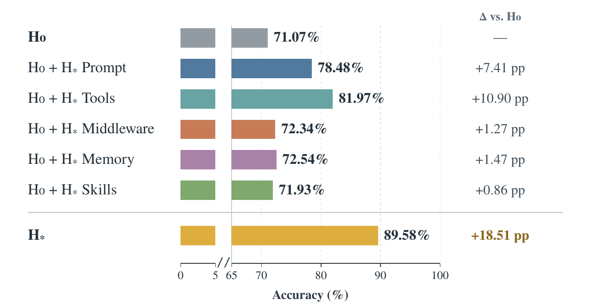

<div align="center">

# EvoGroup

### Self-Evolving Memory Harness for Shared-Context Group Agents

**Interact. Analyze. Evolve.**

<a href="#results"></a>


[Paper Results](#results) · [Overview](#overview) · [Method](#method) · [Results](#results) · [Quick Start](#quick-start) · [简体中文](README_zh.md)

</div>

---

## Overview

**EvoGroup (EvoG)** is a self-evolving memory harness for group agents operating over shared
contexts. It helps an agent preserve who said what, how a discussion developed, and which
information remains current across long multi-user conversations.

Instead of fixing memory organization and retrieval strategies by hand, EvoG improves the
harness surrounding a fixed base model through interaction experience. Starting with **five
basic tools and empty learned memory and skills**, it selects informative trajectories,
inspects evidence on demand, discovers recurring patterns, and revises the harness for the
next round of interactions.

**Paper highlight:** in the paper's DeepSeek-V4-Flash setting, five harness updates raise
EverMemBench pass@1 from **71.07% to 89.58% (+18.51 percentage points)**. The same study reports
lower analysis cost with Adaptive Progressive Disclosure and evaluates frozen transfer to
GroupMemBench. Full results and their scope appear [below](#results).

## Method

<p align="center">
  
</p>

### 1. Interaction

The Group Agent uses the current harness $H_t$ to answer a query over shared group context,
producing an answer, a tool-use trajectory, and subjective confidence. The model-facing answer
uses a stable plain-text protocol (`FINAL ANSWER`, `CONFIDENCE`, and conditional `ANSWER BIAS`);
the runtime stores typed fields and the raw response. For low-confidence answers, it reflects on
uncertainty **before external feedback is revealed**.

The cold-start tools are `list_files`, `read_file`, `grep_search`, `write_file`, and `create_file`.
Original conversation records remain the evidence source; learned notes are navigation aids.
Long-term notes belong to the exact authorized group set; working memory starts fresh per query.

### 2. Confidence-Guided Trajectory Selection

The paper combines confidence with external correctness, using a confidence threshold of 0.5:

| Experience | Signal | Role in analysis |
| --- | --- | --- |
| **CC** — confident and correct | Routine success | Successful context/control |
| **CW** — confident and wrong | An unrecognized failure | Prioritized diagnosis |
| **UC** — unconfident and correct | A fragile success | Prioritized diagnosis + reflection |
| **UW** — unconfident and wrong | A recognized uncertainty or failure | Prioritized diagnosis + reflection |

### 3. From Trace Details to Recurring Patterns

**Adaptive Progressive Disclosure (APD)** exposes a compact structural trace view first.
The Analysis Agent locates relevant stages and requests observations, tool results, or event
fields only when needed. Diagnoses must cite the exact evidence ranges actually inspected.

**Bucketed Analysis** condenses detailed diagnoses, groups them by inferred query semantics,
and compares patterns within and across buckets. The output is a set of high-level findings
with evidence, coverage, counterevidence, and uncertainty.

The CLI groups repeated trials by question and authorized groups, with one diagnosis job per
question. Default synthesis uses failures; uncertain accepted or unjudged answers remain
calibration diagnoses. If diagnosis or synthesis fails, revision can independently inspect
selected traces and register an evidence-backed finding. A repeated pattern needs different
questions, while evidence from one question is explicitly isolated.

### 4. Multi-Interface Harness Revision

The Evolve Agent converts findings into bounded revisions. Each change declares its interface,
evidence, expected behavior, regression risk, and validation check.

| Interface | What changes | Current implementation |
| --- | --- | --- |
| **Representation** | How information is stored, linked, or presented | Metadata, timestamp views and reply references |
| **Operation** | Executable retrieval and evidence operations | Search fields, literal/word matches, conjunction, read/search limits and neighboring records |
| **Policy** | What to select, when, and in which order | Group-agent prompt and reusable Markdown skills |
| **Intervention** | Checks or transformations at execution boundaries | Citation requirements, partial-answer confidence and answer-size limits |

A revised $H_{t+1}$ is versioned and used in subsequent interactions. Source records, model
settings, runtime budgets, and core grounding checks remain fixed. The current release uses
declarative revisions with atomic activation, stale-plan checks, and rollback.
Per-change manifests retain expected fixes, risks and observed results. Benchmark cycles validate
paired trials before activation and can recover a previously active, comparable best version
after a rejected regression.

## Results

The tables and figures report results from the **EvoGroup paper**. Evaluation settings and
result sources are documented in [figure and table sources](assets/README.md).

### EverMemBench

Reported pass@1 (%) from the main-results table. $H_0$ is the initial harness; $H_{*}$ is the
selected evaluated harness. Bold marks the highest reported aggregate in each backbone column.

| Method | GPT-5.5 | DeepSeek-V4-Flash | GLM-5.1 |
| --- | ---: | ---: | ---: |
| Mem0 | 56.50 | 43.71 | 52.42 |
| MemOS | 49.25 | 39.17 | 47.04 |
| A-MEM | 61.71 | 47.00 | 58.75 |
| MemRL | 61.54 | 55.92 | 57.33 |
| Codex | **85.67** | 82.63 | 77.88 |
| Claude Code | 84.58 | 85.75 | 76.46 |
| EvoGroup $H_0$ | 68.33 | 71.07 | 68.27 |
| EvoGroup $H_{*}$ | 84.52 | **89.58** | **83.63** |
| **$H_0$ → $H_{*}$ change** | **+16.19 pp** | **+18.51 pp** | **+15.36 pp** |

The paper uses 720 fixed evolution questions drawn from 2,400 EverMemBench questions,
plus 1,680 separate held-out questions.

### Frozen Transfer to GroupMemBench

The evolved harness is applied without further evolution or tuning. The paper reports
745 questions and the following aggregates:

| Backbone | $H_0$ | Frozen $H_{*}$ | Change |
| --- | ---: | ---: | ---: |
| GPT-5.5 | 61.88% | 63.89% | +2.01 pp |
| DeepSeek-V4-Flash | 74.09% | 71.14% | −2.95 pp |

### Analysis Efficiency and Component Ablation

Across five matched analysis iterations, APD reports **42.5% less analysis time** and
**41.5% fewer tokens** on average than full-trace analysis.

<p align="center">
  
</p>

The original component-ablation graphic compares individual evolved components with the
initial harness. Tools and prompts show the largest individual gains in this setting. The paper
also reports reduced performance when APD or bucketed analysis is removed, while trajectory
selection has limited benefit in the tested process ablation.

## Quick Start

### Install

Use **Python 3.11+** and [uv](https://docs.astral.sh/uv/). From the repository root:

```bash
uv sync --locked --extra dev
uv run evog --help
```

<details>
<summary>Install with a regular Python virtual environment</summary>

```bash
python -m venv .venv
source .venv/bin/activate
python -m pip install -e '.[dev]'
evog --help
```

On Windows PowerShell, activate with `.venv\Scripts\Activate.ps1`.
Use `evog` in place of `uv run evog` after activating this environment.

</details>

### Configuration

Copy [.env.example](.env.example), replace the placeholder endpoint, model, and API key, and
export the variables in your shell. EvoG does not load `.env` files automatically. Use
[examples/benchmark.toml](examples/benchmark.toml) as a starting point for deployment and
benchmark settings, then pass it with `--config`:

```bash
set -a
source .env.example
set +a
uv run evog --config examples/benchmark.toml --workspace /tmp/evog-demo demo
```

### Run the Offline Demo

```bash
uv run evog --workspace /tmp/evog-demo demo
# or use the checked-in wrapper
./examples/run_demo.sh
```

The demo uses synthetic conversations and a deterministic fixture provider. It runs import,
cited answering, feedback, trace analysis, revision planning, and activation without network
requests. It verifies the command flow; it is not a model-quality experiment.

### Query Your Own Group Context

```bash
export EVOG_BASE_URL=https://your-provider.example/v1
export EVOG_MODEL=your-model
export EVOG_API_KEY=your-key

uv run evog init
uv run evog ingest examples/messages.jsonl
uv run evog groups
uv run evog ask 'What is the latest release schedule?' --group product
```

The provider must support Chat Completions and function tools. Supply UTF-8 JSONL messages
with `group_id`, `message_id`, `sender`, timezone-aware `timestamp`, and `text`.
`reply_to` and string-valued `metadata` are optional. See [example messages](examples/messages.jsonl).
Duplicate imports are idempotent; conflicting content under the same source ID rejects the import.
Repeat `--group` for a query over multiple authorized groups.

### Analyze and Revise

```bash
uv run evog feedback RUN_ID rejected --source user
uv run evog select
uv run evog analyze
uv run evog propose ANALYSIS_ID
uv run evog apply PLAN_ID
uv run evog revisions
uv run evog rollback REVISION_ID
```

Record `accepted` or `rejected` according to the actual outcome; the example selects a failure
for diagnosis. Use the IDs printed by the preceding commands. Apply only a plan with changes.
`apply` activates a structurally validated candidate; its business effect must be checked in
subsequent use. An empty plan is valid when no finding supports a change. Use `trace RUN_ID` to
inspect a run and `ask --json` for structured output.

## Project Structure

```text
EvoG/
├── src/evog/
│   ├── cli.py                # evog command entry point
│   ├── app.py                # internal command orchestration
│   ├── runtime.py            # group interaction and pre-feedback reflection
│   ├── tools.py              # five scoped evidence/navigation tools
│   ├── analysis.py           # selection, APD, diagnoses and bucketed findings
│   ├── evolution.py          # plans, candidate validation and activation
│   ├── harness.py            # four bounded revision interfaces
│   ├── store.py              # messages, traces, feedback and versioned harnesses
│   ├── providers.py          # model transport
│   └── prompts/              # group, reflection, analysis, synthesis and revision
├── assets/                   # paper framework and ablation figures
├── examples/                 # synthetic messages and command-line demo
├── tests/                    # regression checks without paid API calls
└── .github/workflows/ci.yml   # lint, tests, packaging and offline demo
```

## Benchmarks

EvoG supports **EverMemBench** and **GroupMemBench** with official scoring protocols,
episode-ID selection, per-question memory isolation and paired candidate validation.
`--trials N` repeats each question independently; `--resume` continues an interrupted checkpoint
with matching inputs and runtime. Both note layers are isolated for every benchmark trial.
Provide a local EverMemBench root containing `dataset/`, or a GroupMemBench root containing
`data/final/` and `questions/`. Use `uv run evog benchmark --help` for run and cycle options.

```bash
uv run evog benchmark list evermembench --data-root /path/to/EverMemBench --topic 01 --limit 2
uv run evog benchmark cycle groupmembench --data-root /path/to/GroupMemBench-main \
  --domain Finance --question-type multi_hop --limit 2 --output results.json
```

## Development

```bash
uv run pytest
uv run ruff check .
uv run ruff format --check .
uv build
```
