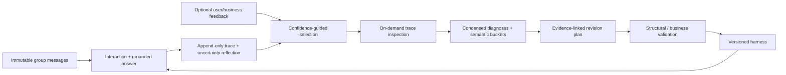

# Architecture

EvoG separates immutable conversation evidence from a versioned memory harness. Interaction
traces and external feedback drive analysis, evidence-linked revision and candidate validation.

## Module boundaries

| Module | Responsibility |
| --- | --- |
| `app.py`, `cli.py` | Internal command orchestration and the user-facing command interface |
| `models.py`, `config.py` | Input/output contracts; fixed deployment configuration |
| `store.py` | SQLite transactions, immutable sources, traces, feedback and revisions |
| `tools.py` | Five tools over frozen scoped source views, notes and skills |
| `runtime.py` | Bounded model/tool loop, delivered-evidence checks and pre-feedback reflection |
| `analysis.py` | Selection, progressive event disclosure, diagnosis and semantic synthesis |
| `harness.py`, `evolution.py` | Four declarative revision surfaces, candidate validation and activation |
| `providers.py` | Model protocol and reusable HTTP transport |
| `benchmark_data.py`, `benchmark_judge.py`, `benchmarks.py` | Dataset readers, official scoring and paired evaluation cycles |
| `demo.py` | Explicit offline fixture; excluded from live provider selection |

The initial harness has exactly `list_files`, `read_file`, `grep_search`, `write_file`,
and `create_file`, with empty memory and skills. The source store is separate from learned
navigation notes. A run freezes the active revision and source view at its start.

The model-facing tool schema follows the Desktop harness: file tools use a logical `target` and
relative `resource_path`; `grep_search` uses a current-hop `query`, bounded `patterns`, optional
ranking anchors and `required_pattern_groups`; writes are restricted to `memory_store` and expose
explicit append/replace or overwrite controls. The runtime may accept legacy EvoG aliases when
replaying old traces, but new tool definitions expose only this schema.

`context/` and its `memory_units/` alias expose the same read-only source records.
`memory_store/long_term_memory/` holds navigation notes for the exact authorized group set;
`memory_store/working_memory/`, also exposed as `memory/`, starts fresh per query.
Benchmark trials isolate both layers per attempt and stage. A runtime-owned search/read ledger
keeps the newest whole entries within 64 KB and is excluded from search. Large tool results
are saved in run-scoped, read-only archives for progressive recovery.

## Experience and feedback

The paper's externally supplied correctness signal maps to application acceptance or business
validation. `CC`, `CW`, `UC`, `UW` use confidence above/below the configured threshold and the
latest categorical feedback; these labels indicate the supplied feedback, not independently
established correctness. A correction appends a new feedback record. Old records are retained.

Unjudged low-confidence runs remain a separate selected category. Unjudged high-confidence runs
are not presumed correct. Output-contract failures and budget exhaustion are eligible diagnostic
experiences because they expose product behavior without a final answer. Provider and tool
failures remain infrastructure categories, alongside unfinished runs.
Coverage includes total runs, every category, eligible/selected counts and sampled controls.
Selection is bounded and failure-first, then ordered by creation time and run ID within priority.
A benchmark cycle scopes selection to that batch. Trials are grouped by revision, exact question
and sorted authorized groups, with one diagnosis job per question. `analysis_max_runs` caps jobs
without cutting off eligible trials of a selected question. The analyst can inspect the other
trials of that question in the batch. Reports preserve failed or invalid diagnoses in `incomplete`.
This marks an unavailable diagnosis, not a requirement to read every trace event. Minimum valid
coverage governs synthesis; a partial report can still support independent revision-stage review.
The at-most-two controls are available comparisons; they are not claimed to be semantically nearest.

## Progressive disclosure and evidence

An analyst initially sees the question, subjective confidence, the raw text-protocol answer and
reflection, categorical feedback
and event structure. `search_trace` locates events. `inspect_trace` exposes a JSON-pointer field
or event with a bounded character range. For a truncated tool event, `read_tool_result` reads only
the run-scoped archive path recorded by that event; it cannot access arbitrary workspace files.
Diagnosis references must exactly match delivered
`(run_id, event_index, field_path, start_char, end_char)` tuples for that analyst's request, and
each range must contain at least one character. JSON Pointer array indexes are strict nonnegative
decimal indexes; negative indexes and `-` are rejected.
Search hits alone cannot be cited. A truncated range establishes only its delivered content.

The same model emits a detailed diagnosis and a condensed rationale. Diagnoses are grouped by
stable semantic query families. Default synthesis uses error-repair diagnoses; accepted/unjudged
low-confidence runs remain calibration inputs rather than observed errors. Free-form query labels
remain descriptive. Repeated patterns need distinct supporting questions in their group scopes;
multiple trials of one question count once. Synthesis
may cite only included, inspected diagnosis evidence. Isolated observations carry explicit limits.
Invalid schema, evidence or quality outputs receive bounded corrections; unrecoverable diagnoses
and context omissions remain visible in coverage.

## Revisions and validation

Harness snapshots are content-addressed. A plan names its parent revision, source analysis,
logical changes, interface, finding references, expected effects, risks and falsifiable checks.
An allowlist prevents edits to source data, model settings, budgets, feedback and the fixed kernel.
Configuration schemas impose ceilings on operations and output sizes. The answering wire contract
is plain text (`FINAL ANSWER`, `CONFIDENCE`, and conditional `ANSWER BIAS`); parsed answer fields,
raw responses and internal provenance remain typed in SQLite. Core citation checks live
outside editable prompts. Candidate screening rejects trace IDs, source references and complete
verbatim source records in generated content. This screening cannot detect every paraphrase or
semantically task-specific rule; review reusable content and run business regression checks.

The internal revision runner's optional validator receives the candidate `Harness`. It must return exactly `True`
to authorize business-validated activation; false or an exception leaves the active revision
unchanged. Activation atomically compares the parent with the active revision. A stale proposal
cannot overwrite newer work. Source records, traces and navigation notes are preserved by rollback.
Revision history marks validation as `structural` or `business`. The revision agent can read supplied
analyses/traces, validate drafts and repair errors within a bounded loop. Configuration surfaces
implement timestamp/reply presentation, field and match selection, read/search limits, confidence
checks and citation requirements; they do not execute arbitrary generated code.

When synthesis is unavailable, the revision agent can inspect selected/control traces and use
`register_finding` with exact evidence ranges delivered in that session. Registration verifies
the declared purpose and independent question support. A validated finding can support a plan;
missing evidence remains a limitation. Every plan saves an immutable per-change manifest.

Candidate evaluations retain predictions, associated fixes/regressions, rejected attempts and the
best observed revision on the same corpus, selection and model. Per-change associations across a
combined candidate are not causal attribution. Scores do not authorize activation by themselves.
Benchmark cycles require a verified net improvement by default; a no-regression policy also requires
an improvement. Unknown infrastructure/judge outcomes prevent business acceptance. An observed
budget or output-contract failure counts as execution failure for transition decisions without
being mislabeled as an official wrong-answer judgment. `apply` without a business validator only
performs structural validation. Bounded repeated cycles stop on rejection or no supported change.
Each evaluation records per-change repaired, still-failed, risk-realized and unverified runs.
Comparable best-ever observations use fully scored trials only. After a rejected regression,
the benchmark runner can recover the best comparable version that was previously active.
Staged candidates cannot become active through recovery. Activation, recovery and evaluation
have persistent audit records. Checkpoints preserve trials and iteration artifacts; resume
checks fixed inputs and revision state before continuing.

## Operational boundaries

- This is a local command-line framework. A deployment supplies its own authentication,
  authorization, scheduling and any chat UI. Group scope is an access boundary, not user identity.
- Workspace files contain private conversation data. The source database is owner-only on POSIX;
  filesystem permissions and deployment isolation remain the operator's responsibility.
- Memory notes are isolated by the exact set of authorized groups. A single-group query cannot
  read a multi-group note. Reusable skills are shared across groups and must contain general guidance.
- Python plugins and arbitrary generated code are not an automatic evolution surface. Operation
  changes modify implemented bounded search behaviors. Add new capabilities in reviewed runtime code.
- There is no embedding service, distributed worker queue, deletion API or retention service
  in this release. SQLite and source scans target local workloads; very large corpora may need
  an indexed backend behind the tool boundary.
- Stable citation validation proves provenance and delivery, not entailment or factual accuracy.
  Prompt-injection guidance plus scoped tools constrain access; they do not guarantee a model never
  follows misleading text within its authorized evidence.
- Provider compatibility depends on supported function tools and request parameters. Live
  compatibility and business quality must be validated for the chosen deployment.
