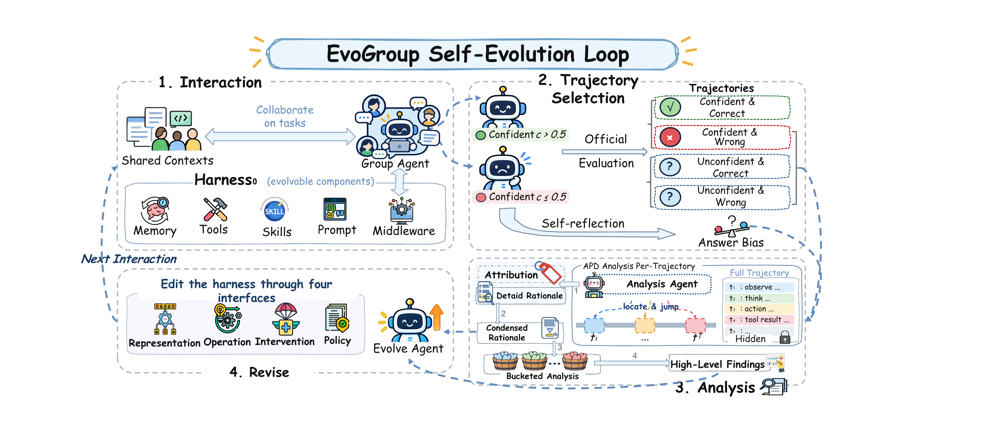

# EvoGroup paper

**EvoGroup: Self-Evolving Memory Harness for Shared-Context Group Agents**

EvoGroup evolves a group agent's memory harness through interaction, confidence-guided
trajectory selection, progressive analysis and evidence-linked revision.

## Motivation

Shared group contexts distribute evidence across people, channels, topics and time. An event
may be proposed by one person, revised by another, and completed in a later thread. A useful
group agent must preserve attribution, reply dependencies, collaborative knowledge and changing
status. EvoGroup treats the surrounding memory harness as the object of evolution while keeping
the underlying model fixed within a run.

## Method

The initial harness has five tools: `list_files`, `read_file`, `grep_search`, `write_file`,
and `create_file`. Skills and learned memory start empty. The loop has four stages:

1. **Interaction:** use the current harness to answer queries over shared context and record the
   trajectory and subjective confidence. Generate low-confidence self-reflection before any
   external supervision is revealed.
2. **Trajectory selection:** combine confidence with externally supplied correctness. With
   threshold 0.5, prioritize confident-wrong, unconfident-correct and unconfident-wrong trajectories;
   confident-correct behavior supplies routine-success context.
3. **Analysis:** Adaptive Progressive Disclosure exposes a structural trace view first, then
   relevant local observations/actions on demand. Detailed diagnoses are condensed and bucketed
   by inferred query semantics; within-bucket and across-bucket analysis produces high-level findings.
4. **Revision:** update information representation, executable operations, decision policy or
   boundary interventions according to evidence-linked findings; evaluate the resulting harness
   in a subsequent interaction round.

## Reported results

The main EverMemBench table reports the following aggregates:

| Backbone | Initial H₀ | Evolved H* | Change |
| --- | ---: | ---: | ---: |
| GPT-5.5 | 68.33% | 84.52% | +16.19 pp |
| DeepSeek-V4-Flash | 71.07% | 89.58% | +18.51 pp |
| GLM-5.1 | 68.27% | 83.63% | +15.36 pp |

The paper uses 720 fixed evolution questions sampled from 2,400 EverMemBench
questions, 1,680 separate held-out questions, and frozen transfer to 745 GroupMemBench questions.
The reported values follow the main table's aggregate convention.

Frozen GroupMemBench transfer is model-dependent: GPT-5.5 changes from 61.88% to 63.89%, while
DeepSeek-V4-Flash changes from 74.09% to 71.14%. The latter is a 2.95 pp regression. On the main
EverMemBench table, GPT-5.5 H* (84.52%) remains below Codex (85.67%) and Claude Code (84.58%).
The results therefore do not establish uniform superiority across backbones and distributions.

The APD comparison reports 42.5% less analysis time and 41.5% fewer tokens on average over five
iterations versus full-trace analysis under the stated matched analysis settings. The process
ablation reports limited benefit for trajectory selection in its tested setting, while removing
APD and bucketed analysis reduces performance. Self-reflection is a localization signal;
trajectory evidence remains necessary to verify a cause.

## Implementation

The repository implements group-context interaction, optional categorical acceptance feedback,
bounded trace inspection, bucketed findings, manifest-based revision and rollback. Source data,
model configuration and core evidence checks stay outside the evolvable surfaces. Revision uses
bounded declarative configuration, prompts and Markdown skills. Benchmark cycles add official
scoring and paired candidate evaluation before activation.
Repeated executions are diagnosed per question and authorized group scope. Failure synthesis and
confidence calibration are separate; partial analysis can be supplemented by independently
inspected trace evidence during revision. Per-change manifests retain predictions and observed
associations, and evaluation checkpoints support independent trials and interruption recovery.

## Source notes

| Content | Paper source |
| --- | --- |
| Title and motivation | `iclr2027_conference.tex`, title, Abstract and Introduction |
| Five-tool cold start and four stages | `iclr2027_conference.tex`, EvoGroup method sections |
| Confidence groups, APD and buckets | `iclr2027_conference.tex`, Confidence-Guided Experience Selection and Trajectory Analysis |
| EverMemBench baseline/model values | `tables/main_tables.tex`, main results table, Average column |
| Frozen transfer values | `tables/ood.tex`, GroupMemBench results table, Average column |
| APD analysis time/token reductions | `iclr2027_conference.tex`, Analysis of Adaptive Progressive Disclosure |
| Framework image | `figures/EvoWorkspace_Self_Evolution_Loop.pdf` |
| Component-ablation image | `figures/harness_ablation.pdf` |

The component-ablation graphic reports H₀=71.07%, H*=89.58%, Prompt +7.41 pp and Tools +10.90 pp.
Its corresponding prose reports H₀=71.11%, H*=89.55%, Prompt +7.38 pp and Tools +10.86 pp.
The graphic and main-results table use the 71.07% → 89.58% pair. The Introduction figure caption
refers to seven iterations, while the main-results text describes five updates and six evaluated
checkpoints. The README uses the main-results text's iteration count.

Paper results and software validation are reported separately. Local release checks are listed
in [release validation](release-validation.md).
